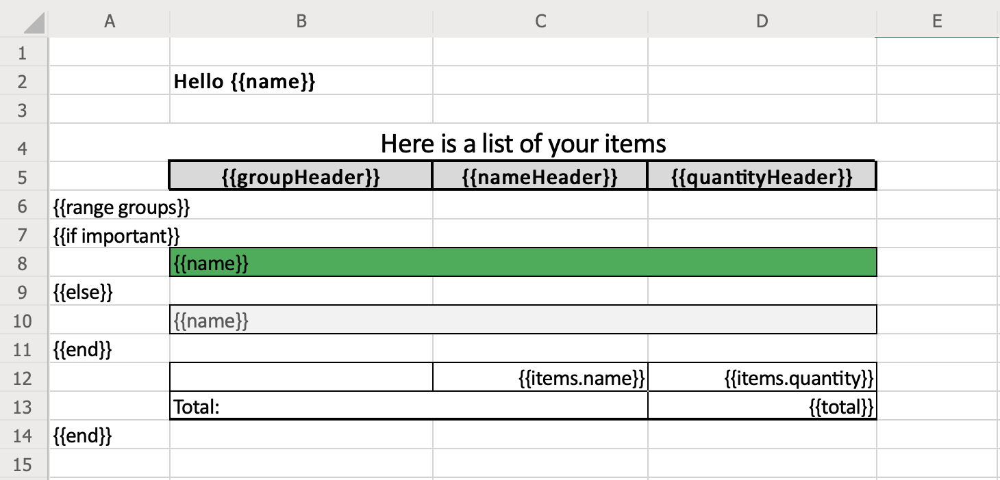
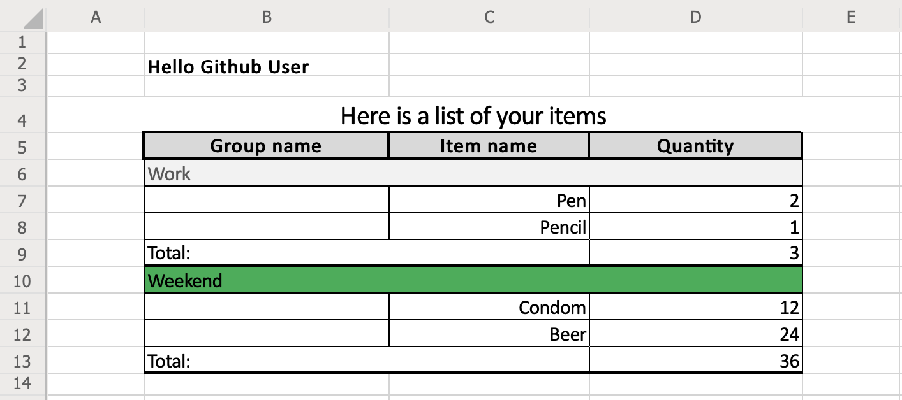

# go-xlsx-templater
Simple **.xlsx** (Excel XML document) template based document generator using handlebars.

Takes input **.xlsx** documents with mustache sippets in it and renders new document with snippets replaced by provided context.

## Installation

```
    go get -u "github.com/ivahaev/go-xlsx-templater"
```

## Usage

### Import to your project

```go
    import "github.com/ivahaev/go-xlsx-templater"
```

### Prepare **template.xlsx** template. Filename may be any of course. For slices use dot notation `{{items.name}}`. When parser meets dot notation it will repeats contains row.



### Prepare context data

```go
    ctx := map[string]interface{}{
        "name": "Github User",
        "nameHeader": "Item name",
        "quantityHeader": "Quantity",
        "items": []map[string]interface{}{
            {
                "name": "Pen",
                "quantity": 2,
            },
            {
                "name": "Pencil",
                "quantity": 1,
            },
            {
                "name": "Condom",
                "quantity": 12,
            },
            {
                "name": "Beer",
                "quantity": 24,
            },
        },
    }
```

### Read template, render with context and save to disk.

```go
    doc := xlst.New()
	doc.ReadTemplate("./template.xlsx")
	err := doc.Render(ctx)
	if err != nil {
		panic(err)
	}
	err = doc.Save("./report.xlsx")
	if err != nil {
		panic(err)
	}
```

## Enjoy created report



#### type Xlst

```go
type Xlst struct {
    // contains filtered or unexported fields
}
```

Xlst Represents template struct

#### func  New

```go
func New() *Xlst
```
New() creates new Xlst struct and returns pointer to it

#### func (*Xlst) ReadTemplate

```go
func (m *Xlst) ReadTemplate(path string) error
```
ReadTemplate() reads template from disk and stores it in a struct

#### func (*Xlst) Render

```go
func (m *Xlst) Render(ctx map[string]interface{}) error
```
Render() renders report and stores it in a struct

#### func (*Xlst) Save

```go
func (m *Xlst) Save(path string) error
```
Save() saves generated report to disk

#### func (*Xlst) Write

```go
func (m *Xlst) Write(writer io.Writer) error
```
Write() writes generated report to provided writer
